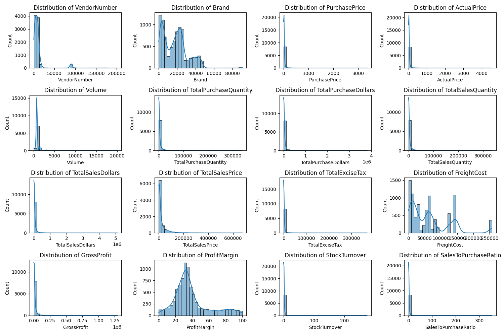
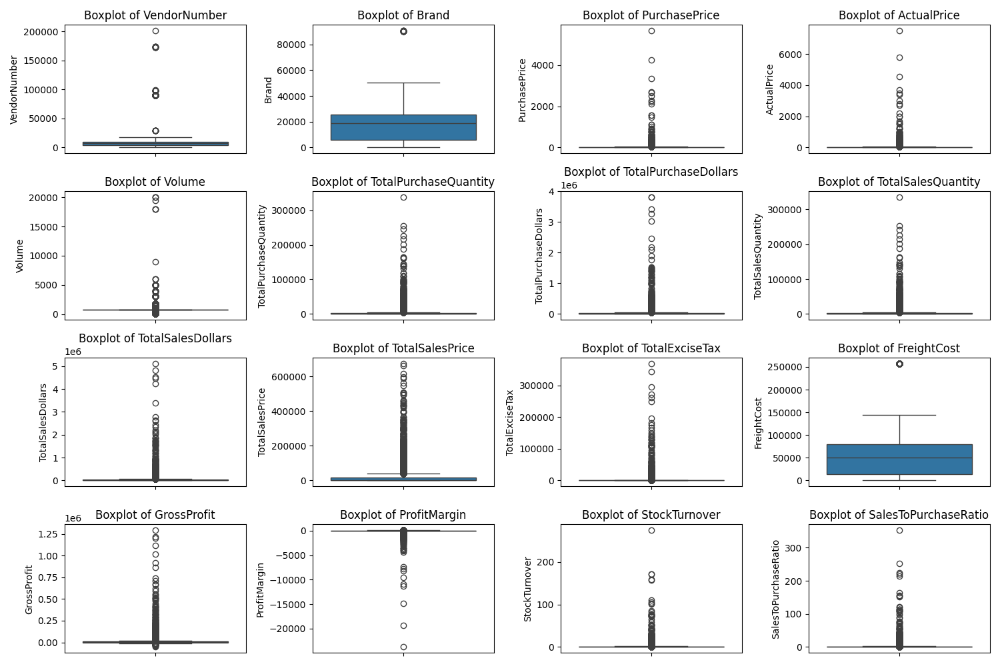
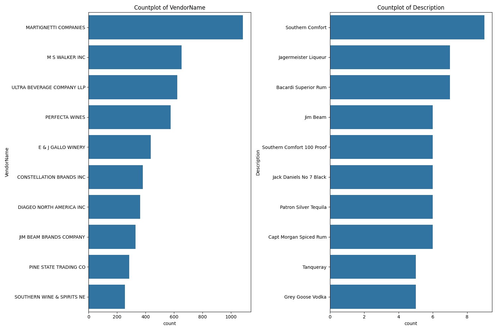
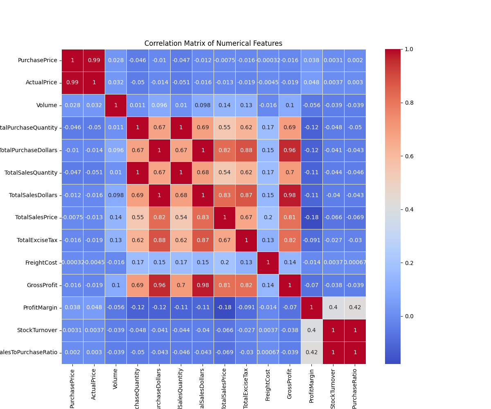
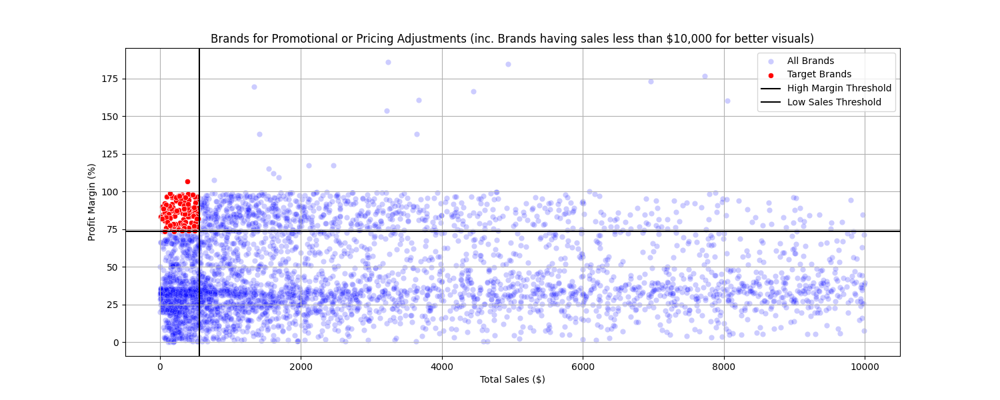
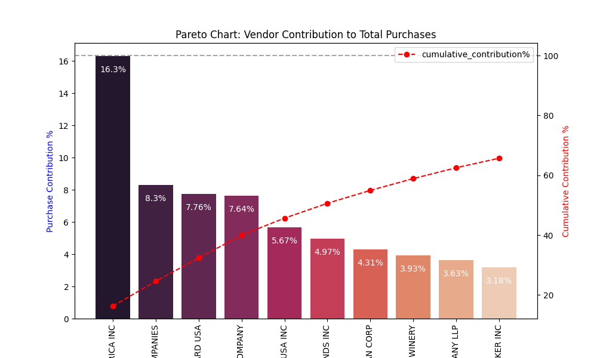
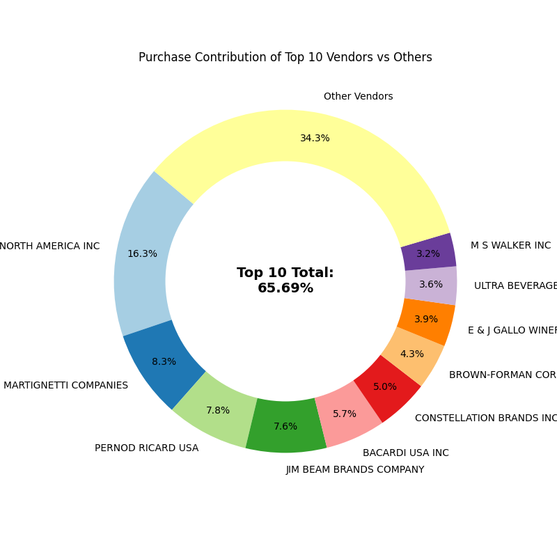
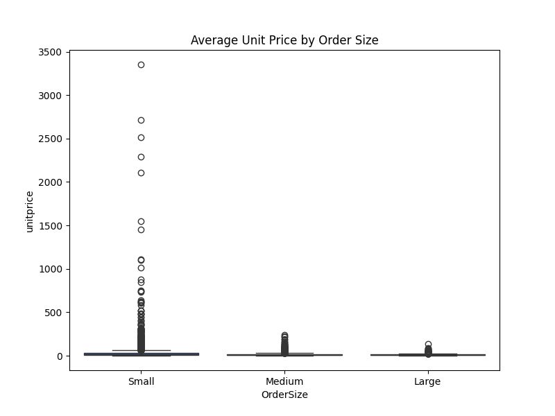
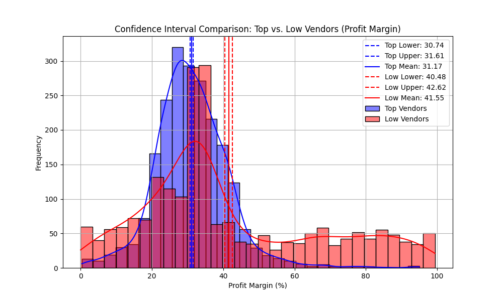

# 📊 End-to-End Vendor Sales Summary Data Analysis


  


## 🚀 Project Overview

This project is a complete end-to-end data analysis pipeline built using Python, SQLite, and data visualization libraries. It focuses on analyzing vendor-level sales, purchases, and profitability to generate actionable business insights.

### :repeat: The pipeline includes:

- Data ingestion from CSV files into a SQLite database
- Data transformation and feature engineering
- Exploratory Data Analysis (EDA)
- Vendor and brand performance analysis
- Statistical testing and insights generation
- Visualization and reporting


## 🏗️ Project Architecture  
Raw CSV Files (data/)  
        ↓  
SQLite Database (inventory.db)  
        ↓  
Data Transformation & Feature Engineering (EDA.py)  
        ↓  
Cleaned Summary Table (vendor_sales_summary)  
        ↓  
Analysis & Visualization (vendor_analysis.py)  
        ↓  
Outputs (CSV files + Plots + Insights)  


## 📁 Project Structure
```bash
├── data/                   # Raw CSV files  
├── Images/                 # Saved plots  
├── Final_Analysis_Files/   # Final processed CSV outputs  
├── logs/                   # Log files  
├── Power BI Dashboard/     # Dashboard files  
├── ingestion_db.py         # Data ingestion into SQLite  
├── EDA.py                  # Data transformation & feature engineering  
├── vendor_analysis.py      # Analysis & visualization  
├── logger.py               # Logging utility  
├── format_values.py        # Number formatting utility  
├── inventory.db            # SQLite database   
└── README.md               # Documentation 
```
## :gear: Tech Stack
- Python
- Pandas, NumPy
- SQLite (SQLAlchemy)
- Matplotlib, Seaborn
- SciPy (Statistical Testing)
- Custom Logging

### 🔄 Data Pipeline Explained
1️⃣ :inbox_tray:  Data Ingestion (SQLite)  

:file_folder: ingestion_db.py

- Reads all CSV files from data/ directory  
- Loads them into SQLite database (inventory.db)  
- Each CSV becomes a separate table  
- Key Function:  
`def ingest_db(df, table_name, engine):`  
    `df.to_sql(table_name, con=engine, if_exists='replace', index=False)`  

:computer: Run:  
`python ingestion_db.py`  

2️⃣ :gear:   Data Transformation & Feature Engineering  

:file_folder: EDA.py  

This script:

- Joins multiple tables using SQL (CTEs)  
- Creates a vendor_sales_summary table  
- Cleans and enriches data  
- Key SQL Logic:
    - Freight aggregation
    - Purchase aggregation
    - Sales aggregation
    - Final joins across all tables
- Feature Engineering:  
    - GrossProfit
    - ProfitMargin (%)
    - StockTurnover
    - SalesToPurchaseRatio  
:Example:  
`vendor_sales_summary['GrossProfit'] = TotalSalesDollars - TotalPurchaseDollars`
`vendor_sales_summary['ProfitMargin'] = (GrossProfit / TotalSalesDollars) * 100`  

:computer: Run:  
`python EDA.py`

3️⃣ :broom: Data Cleaning  

-Performed in clean_vendor_sales_summary():  
    - Handle missing values (fillna(0))
    - Trim text columns
    - Convert data types
    - Handle divide-by-zero safely

 4️⃣ :bar_chart: Analysis & Visualization  

:file_folder: vendor_analysis.py  
This is the core analytics engine of the project.  

📊 Key Analysis Performed  
🔹 1. Data Filtering   

- Extract quality dataset:
    - Positive profit
    - Positive sales
    - Valid margins

🔹 2. Exploratory Data Analysis (EDA)
- Histograms with KDE


- Boxplots (outlier detection)


- Categorical count plots


- Correlation heatmap


🔹 3. Brand Performance Analysis
- Identifies:
    - Low sales but high profit brands
    - Potential pricing or promotion opportunities


🔹 4. Vendor Performance Analysis
- Total purchases
- Total sales
- Profit contribution
- Purchase contribution %

Includes:
    - Top 10 vendors
    - Pareto chart

    - Donut chart visualization


🔹 5. Inventory & Pricing Insights
- Low stock turnover vendors
- Unsold inventory value
- Unit price vs order size


🔹 6. Statistical Analysis
- Confidence Intervals

- Compare profit margins of:
    - Top vendors
    - Low-performing vendors  
- Hypothesis Testing
    - Welch’s T-test:
    - ttest_ind(top_vendors, low_vendors, equal_var=False)

📈 Outputs Generated  

- 📂 CSV Files
    - vendor_sales_summary.csv
    - vendor_sales_quality_data.csv
    - vendor_performance.csv
    - brand_performance.csv
    - unsold_inventory_value_per_vendor.csv

- 🖼️ Visualizations
    - Histograms
    - Boxplots
    - Heatmaps
    - Pareto charts
    - Scatter plots
    - Donut charts

## ▶️ How to Run the Project
### Step 1: Install Dependencies
`pip install pandas numpy matplotlib seaborn sqlalchemy scipy`
### Step 2: Ingest Data
`python ingestion_db.py`
### Step 3: Create Summary Table
`python EDA.py`
### Step 4: Run Analysis
`python vendor_analysis.py`

📊 Key Business Insights You Can Extract
1. Which vendors contribute most to revenue
2. Vendors with high unsold inventory (capital risk)
3. High-margin but low-sales brands (growth opportunities)
4. Inventory inefficiencies
4. Statistical difference between top vs low vendors

:brain: Learning Outcomes

- This project demonstrates:
    - End-to-end data pipeline design
    - SQL + Python integration
    - Feature engineering in real-world datasets
    - Data visualization best practices
    - Statistical hypothesis testing
    - Business-driven analytics


# 📊 Power BI Dashboard  

An interactive Power BI dashboard has been built on top of the processed dataset (vendor_sales_summary) to provide business-friendly insights and visual exploration.

- :page_facing_up: [Power BI Dashboard](Power%20BI%20Dashboard/Vendor_Summary_Data.pdf)

## 🔍 Key Features:    
- Vendor Performance Analysis – Track top vendors by sales, profit, and contribution %
- Brand Insights – Identify high-margin, low-sales brands for strategic decisions
- Inventory Monitoring – Analyze unsold inventory and stock turnover
- Profitability Metrics – Visualize Gross Profit and Profit Margins across vendors
- Interactive Filters – Slice data by vendor, brand, and other dimensions

## 📈 Business Value:  
- Helps identify high-performing vendors and underperforming segments
- Enables better inventory and pricing decisions
- Supports data-driven decision making through dynamic visualizations

🔧 Future Improvements
- Automate pipeline with Airflow
- Add machine learning (sales prediction)
- Optimize SQL queries for large-scale data
- Deploy as a data product / API


👨‍💻 Author

**Ashish Kumar**